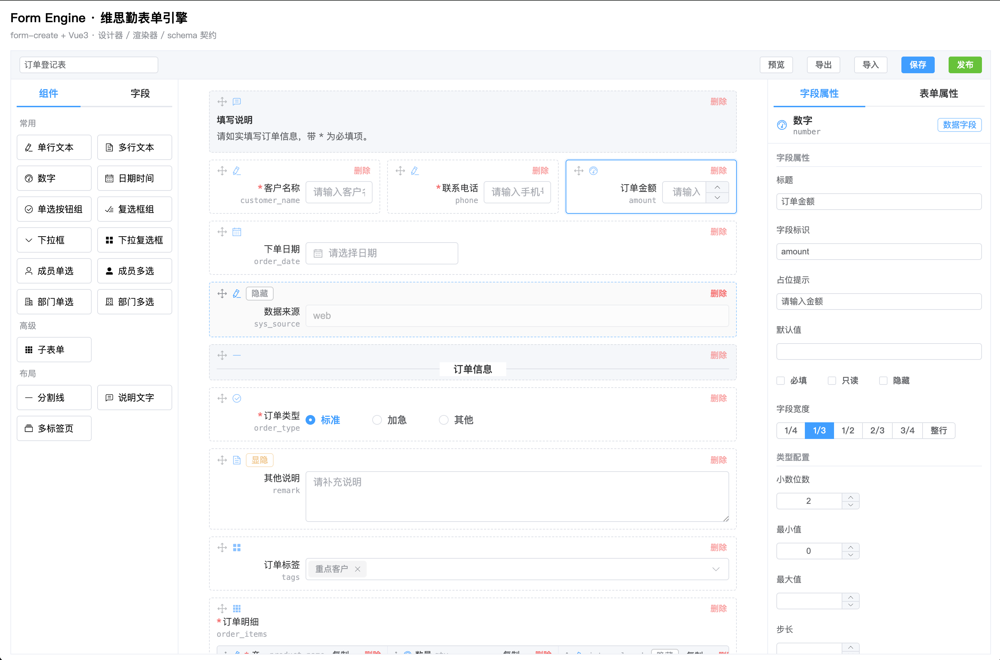

# Form Engine · 维思勤在线表单引擎

基于 **form-create + Vue 3 + Element Plus** 的 JSON 驱动在线表单引擎，提供「**设计器 / 渲染器 / schema 契约**」三层能力。引擎级 `form-schema` 与 form-create 的 `rule` 完全解耦，通过适配层单向转换；提供基础控件（常用字段 12 类 + 高级字段子表单 + 布局字段 3 类），不引入 form-create 的全部组件。

- **设计器（FormDesigner）**：拖拽画布 + 所见即所得控件预览 + 属性面板（字段/表单双 tab）+ 校验/显隐/整表提交校验可视化配置 + 发布与字段复用 + 导入/导出。
- **渲染器（FormRenderer）**：加载 schema 实时填报，负责数据双向绑定、校验、显隐求值、静态隐藏、只读/重置/提交输出。
- **Schema 契约（form-schema）**：描述一张表单的纯 JSON 结构，作为设计器输出、渲染器输入与后续持久化的唯一稳定契约（当前契约版本 `1.1`）。



## 特性

- 🎨 **单一字段注册表驱动**：同一份字段定义同时驱动设计器面板、画布预览、子表单单元格与运行态 rule 生成，杜绝「画布一套、填报一套」的漂移。
- 🧩 **统一渲染单轨**：控件形态由 `FieldDefinition.control` 单一来源承载，新增字段类型仅需 2 处改动即可全链路自动生效。
- 📋 **子表单明细**：既是数据字段（值为对象数组）又是子字段容器，支持行增删、初始/最大行数钳制、左右固定列、批量删除、单元格级校验。
- 🔒 **发布与字段复用**：发布后字段标识锁定，可反复发布并递增版本；已发布字段快照进「字段」面板，删除后仍可原样拖回沿用标识。
- 🙈 **双轨隐藏**：静态隐藏（`hidden`，保留值、优先级更高）与条件显隐（`visibleRule`，剔除值）互不串台。
- ✍️ **字段标识命名护栏**：仅允许字母/数字/下划线，拦截系统保留字与 SQL 注入关键词，词表集中可增删。
- ✅ **可视化校验与联动**：必填、长度、数值、正则（手机/邮箱/URL/身份证/自定义）等校验，与基于其它字段取值的显隐、整表提交校验规则。

## 技术栈

| 依赖                      | 版本（锁定） | 用途                                         |
| ------------------------- | ------------ | -------------------------------------------- |
| `vue`                     | `3.5.13`     | 前端框架                                     |
| `element-plus`            | `2.8.8`      | UI 组件库                                    |
| `@form-create/element-ui` | `3.2.16`     | JSON 驱动表单渲染内核（Element Plus 适配版） |
| `async-validator`         | `4.2.5`      | 校验规则求值（子表单等引擎自持校验）         |
| `vuedraggable`            | `4.1.0`      | 设计器画布拖拽（SortableJS）                 |
| `@element-plus/icons-vue` | `2.3.1`      | 设计器图标                                   |
| `vite`                    | `5.4.11`     | 构建与开发服务器                             |
| `typescript`              | `5.6.3`      | 类型系统（`vue-tsc` 类型检查）               |
| `vitest`                  | `2.1.8`      | 单元 / 集成测试（jsdom 环境）                |

> **版本锁定**：`package.json` 中所有依赖均固定为精确版本（无 `^` / `~`），避免 form-create 次版本升级引入 rule/option 结构或 api 行为的破坏性变更。

## 快速开始

```bash
# 安装依赖
npm install

# 启动开发服务器（默认打开设计器，点工具栏「预览」进入填报态）
npm run dev

# 类型检查 + 生产构建
npm run build

# 运行全部测试
npm run test
```

## 集成与使用

### 1. 应用入口全局注册

在 `src/main.ts` 中注册 `element-plus`、`@form-create/element-ui`，并注册引擎自定义组件（布局/子表单/占位组件）：

```ts
// src/main.ts
import { createApp } from 'vue'
import ElementPlus from 'element-plus'
import 'element-plus/dist/index.css'
import formCreate from '@form-create/element-ui'
import { registerEngineComponents } from '@/renderer/components'

registerEngineComponents() // 注册 engine-divider / engine-tabs / engine-subform / engine-unknown 等

const app = createApp(App)
app.use(ElementPlus).use(formCreate)
app.mount('#app')
```

### 2. 设计器 FormDesigner

```vue
<script setup lang="ts">
import { ref } from 'vue'
import { FormDesigner } from '@/designer'
import type { FormSchema } from '@/schema'

const schema = ref<FormSchema>() // 不传则新建空表单
const dataSources = ref({ members: [], departments: [] }) // 成员/部门候选项
</script>

<template>
  <FormDesigner v-model="schema" :data-sources="dataSources" />
</template>
```

| Prop          | 类型                       | 说明                                        |
| ------------- | -------------------------- | ------------------------------------------- |
| `modelValue`  | `FormSchema`               | 双向绑定的 schema（`v-model`）              |
| `dataSources` | `{ members, departments }` | 注入成员/部门字段的候选项（纯前端，无后端） |

| Event               | 说明                  |
| ------------------- | --------------------- |
| `update:modelValue` | schema 变化时向外交互 |

工具栏提供：预览 / 导出 / 导入 / 保存 / 发布。保存与发布共用同一道结构校验，不通过时一次列出全部 error 级问题并可逐条定位到画布卡片。

### 3. 渲染器 FormRenderer

```vue
<script setup lang="ts">
import { ref } from 'vue'
import { FormRenderer } from '@/renderer'
import type { FormSchema } from '@/schema'

const rendererRef = ref<InstanceType<typeof FormRenderer>>()
function onSubmit(data: Record<string, unknown>) {
  console.log('提交数据', data)
}
</script>

<template>
  <FormRenderer
    ref="rendererRef"
    :schema="schema"
    v-model="formData"
    :readonly="false"
    :data-sources="{ members: [], departments: [] }"
    @submit="onSubmit"
  />
</template>
```

| Prop          | 类型                       | 缺省    | 说明                      |
| ------------- | -------------------------- | ------- | ------------------------- |
| `schema`      | `FormSchema`               | 必填    | 待渲染的表单 schema       |
| `modelValue`  | `Record<string, unknown>`  | `{}`    | 表单数据（`v-model`）     |
| `readonly`    | `boolean`                  | `false` | 整表只读                  |
| `dataSources` | `{ members, departments }` | `{}`    | 成员/部门候选项注入       |
| `showActions` | `boolean`                  | `true`  | 是否显示内置提交/重置按钮 |

| Event               | 说明                                                               |
| ------------------- | ------------------------------------------------------------------ |
| `update:modelValue` | 数据双向绑定                                                       |
| `submit`            | 校验通过后输出提交数据（已剔除被条件显隐隐藏的字段与子表单空白行） |

通过 `ref` 暴露的命令式方法：`getData()` / `setData(patch)` / `validate()` / `clearValidate()` / `reset()` / `submit()` / `getApi()`（`getApi()` 返回底层 form-create 实例，供 `scrollTo` / `focus` 等高级操作）。

## 架构

```
设计器 schema  ──▶  适配层 schemaToRules/schemaToOption  ──▶  form-create rule/option  ──▶  渲染
     ▲                                                                       │
     └───────────────────── 单一字段注册表（设计态与运行态同源）◀────────────┘
```

| 模块          | 职责                                                                                                                                                   |
| ------------- | ------------------------------------------------------------------------------------------------------------------------------------------------------ |
| `schema/`     | 引擎级数据契约：`FormSchema` / `FieldNode` / 校验规则 / 显隐规则 / 静态隐藏标记 + 结构校验器 + 字段标识命名规则 + 遍历工具 + 配置缺省值单一来源        |
| `registry/`   | 单一字段注册表：类型标识、分组、默认节点工厂、属性面板编辑器、控件渲染定义（`control`）、schema→rule 映射器（设计器与渲染器共用）                      |
| `adapter/`    | 适配层：`schemaToRules` / `schemaToOption`，将校验规则映射为 async-validator `validate`，隔离 form-create 细节                                         |
| `renderer/`   | 运行时渲染器 `FormRenderer`：加载 schema、双向绑定、显隐求值、静态隐藏、校验、提交/只读/重置；`engine-*` 自定义组件                                    |
| `designer/`   | 设计器 `FormDesigner`：组件/字段双面板、画布拖拽、`FieldPreview`/`FieldControl` 所见即所得预览、属性面板、校验/显隐/提交校验可视化、发布复用、导入导出 |
| `components/` | `FieldControl.vue`：由注册表 `control` 驱动的共享控件（画布与子表单单元格复用同一渲染）                                                                |

**单一字段注册表** 保证「设计态可见字段」与「运行态可渲染字段」严格一致；**统一渲染单轨** 让控件形态纳入注册表第三维度 `control`，`FieldControl.vue` 与适配层 `toRule` 共用同一份属性映射。项目内置源码级护栏测试（见 `tests/fieldExtensibility.test.ts`、`tests/registry.test.ts`）防止两轨漂移。

### 目录结构

```
src/
├─ adapter/     schemaToRules / schemaToOption、校验规则 → async-validator
├─ components/  FieldControl.vue（注册表 control 驱动的共享控件）
├─ designer/    FormDesigner 及画布/属性面板/编辑器/发布复用/schemaIO
├─ registry/    字段注册表：fields/{common,advanced,layout} + registry/options/types
├─ renderer/    FormRenderer、visibility/submitValidation/subformValidation、engine-* 组件
├─ schema/      类型契约、defaults、fieldId、validate、traverse、width
├─ demo/        sampleSchema（覆盖全字段类型 + 校验 + 显隐 + 静态隐藏）
└─ App.vue      演示入口（挂载 FormDesigner）
tests/          19 个单元 / 集成测试（Vitest + jsdom）
```

## 字段体系

| 分组 | 类型标识                                                                                                                                    | 中文名                                                                                                                          |
| ---- | ------------------------------------------------------------------------------------------------------------------------------------------- | ------------------------------------------------------------------------------------------------------------------------------- |
| 常用 | `input` `textarea` `number` `date` `radio` `checkbox` `select` `selectMultiple` `member` `memberMultiple` `department` `departmentMultiple` | 单行文本 / 多行文本 / 数字 / 日期时间 / 单选按钮组 / 复选框组 / 下拉框 / 下拉复选框 / 成员单选 / 成员多选 / 部门单选 / 部门多选 |
| 高级 | `subform`                                                                                                                                   | 子表单（明细，值为对象数组）                                                                                                    |
| 布局 | `divider` `text` `tabs`                                                                                                                     | 分割线 / 说明文字 / 多标签页（容器，不参与数据收集）                                                                            |

> 成员 / 部门字段为纯前端引擎，候选项通过 `dataSources`（props）注入，渲染为可搜索选择器。子字段的类型受白名单约束：仅常用数据字段，禁止布局字段与嵌套子表单。

## Schema 契约

一张表单即一段纯 JSON，最小示例：

```jsonc
{
  "id": "form_demo",
  "name": "示例表单",
  "version": "1.1",
  "fields": [
    {
      "type": "input",
      "key": "n1",
      "field": "user_name",
      "title": "姓名",
      "required": true,
      "width": 50,
    },
    {
      "type": "select",
      "key": "n2",
      "field": "city",
      "title": "城市",
      "width": 50,
      "options": [{ "label": "北京", "value": "bj" }],
      "validate": [{ "type": "required", "message": "请选择城市" }],
    },
    {
      "type": "subform",
      "key": "n3",
      "field": "detail",
      "title": "明细",
      "subFields": [{ "type": "input", "key": "s1", "field": "item_name", "title": "品名" }],
      "props": { "minRows": 0, "maxRows": 200, "allowBatchRemove": true },
    },
  ],
  "formConfig": { "labelPosition": "right", "labelWidth": 125, "submitButton": { "text": "提交" } },
}
```

关键能力：

- **通用属性**：`title` 标题、`field` 数据标识（表单内唯一）、`width` 宽度百分比（1–100 映射为 24 栅格）、`required` 必填、`placeholder` 占位、`readonly` 只读、`hidden` 静态隐藏。
- **校验规则 `validate`**：`required` / `maxLength` / `minLength` / `max` / `min` / `pattern`（预设 `phone` `email` `url` `idcard` `custom`）/ `custom`。
- **显隐规则 `visibleRule`**：`{ logic, conditions: [{ field, operator, value }], action }`，操作符含 `eq` `neq` `contains` `notContains` `gt` `gte` `lt` `lte` `empty` `notEmpty`，命中即 `show`/`hide`；被条件显隐隐藏的字段值会从输出中剔除。
- **静态隐藏 `hidden`**：填报态不展示控件，但值仍保留并随表单提交，且必填/校验不生效（隐藏优先）；与条件显隐双轨隔离，规则不能解封静态隐藏字段。
- **整表提交校验 `formConfig.submitValidation`**：条件组命中即阻止提交并提示（复用显隐规则条件结构）。
- **发布 `formConfig.published/publishedVersion/publishedFields`**：发布给当时字段打 `published` 标记（标识永久不可改），无「取消发布」，可反复发布并递增版本；`publishedFields` 为每次发布按画布重建的主表字段快照清单。
- **字段标识命名**：`FIELD_ID_PATTERN = /^[A-Za-z0-9_]+$/`，且整体匹配（忽略大小写、不做子串）命中 `SQL_RESERVED_WORDS` 黑名单即拦截，故 `user_name`、`is_deleted`、`insert_count` 仍可用。词表与正则集中在 `src/schema/fieldId.ts`，可直接增删词。

## 扩展新字段类型

得益于统一渲染单轨，新增一个常用数据字段仅需 **2 处**：

1. `src/schema/types.ts`：在 `COMMON_FIELD_TYPES` 等 `as const` 清单中登记类型枚举。
2. `src/registry/fields/common.ts`：调用 `defineDataField({ type, label, control: { component, formCreateType, valueKind, props } })`。

其余零改动——`FieldControl.vue`、`fieldIcons.ts`、`FieldPreview.vue`、`validate.ts`、`registry/index.ts` 全部从注册表派生。若需要特殊 rule 结构（如子表单），可绕开工厂直接声明 `toRule`。

## 脚本命令

| 命令                 | 说明                                               |
| -------------------- | -------------------------------------------------- |
| `npm run dev`        | 启动开发服务器（设计器，工具栏「预览」进入填报态） |
| `npm run build`      | 类型检查（`vue-tsc --noEmit`）+ 生产构建           |
| `npm run preview`    | 预览生产构建产物                                   |
| `npm run test`       | 运行全部单元 / 集成测试（Vitest）                  |
| `npm run test:watch` | 监听模式运行测试                                   |
| `npm run typecheck`  | 仅执行类型检查                                     |
| `npm run lint`       | ESLint 检查（自动修复）                            |
| `npm run format`     | Prettier 格式化 `src/`、`tests/` 与配置文件        |

## 测试

`tests/` 下 19 个 Vitest + jsdom 测试覆盖：schema 契约与结构校验、字段注册表与扩展性护栏、适配层规则生成、显隐/提交校验/子表单校验、设计器交互与拖拽、渲染器集成等。

> form-create 的运行时字段校验（`api.validate`）依赖浏览器环境执行；在 jsdom/vitest 下不会强制执行字段规则。因此提交门控契约通过桩化底层 api 验证，规则生成的正确性由 `tests/adapter.test.ts` 覆盖，运行时校验行为在浏览器中验证。

## 演示

`npm run dev` 后默认进入设计器演示（`src/App.vue` 挂载 `FormDesigner`）：

- 从左侧「**组件**」面板（常用 / 高级 / 布局 三组）拖拽控件到画布，画布以真实控件外观所见即所得呈现；右侧「**字段属性 / 表单属性**」双 tab 配置通用属性、选项、校验与显隐规则；点击画布空白切到表单属性。
- 点「**发布**」锁定字段标识并快照进左侧「**字段**」面板（可反复发布、版本递增）；字段删除后仍可从该面板拖回沿用标识。
- 点工具栏「**预览**」经渲染器实时填报，验证数据收集、校验、显隐与提交输出。

示例表单见 `src/demo/sampleSchema.ts`，覆盖常用字段 + 高级子表单 + 布局字段 + 校验 + 显隐规则 + 静态隐藏。